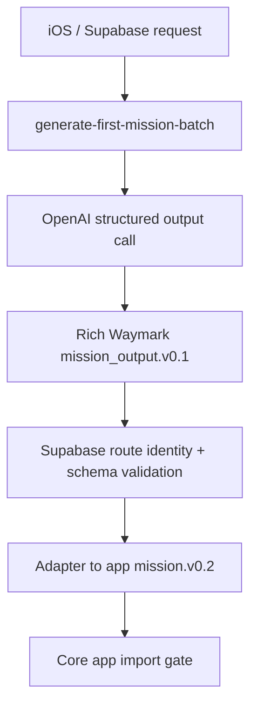

# Waymark Mission Generation Payload / Prompt / Schema Sketch v0.1

Generated: 2026-05-25

Status: `CURRENT_ALPHA_SKETCH_FOR_PRODUCT_REVIEW`

## Why This Exists

The current live Alpha mission-generation path is producing one mission per OpenAI call. Recent route-ready runs show latency around 38-50 seconds per mission, not per ten-mission batch.

This sketch explains what is currently being sent, what comes back, and why the payload is heavy.

## Current Flow



## Current One-Mission Input Shape

Supabase request fields:

```json
{
  "client_request_id": "string",
  "tester_alias": "string",
  "requested_batch_size": 1,
  "survey_evidence_export": {},
  "mission_generation_digest_view": {},
  "candidate_pool": {},
  "prompt_context": {}
}
```

Current route-ready example:

```text
data/mission_generation/alpha_first_batch_route_ready_v0_1/public_profile_01_A3_Al1_S2/20260523T225550Z/
```

Measured token/cost/latency:

| metric | value |
| --- | ---: |
| model | `gpt-5.4-mini` |
| input tokens | `197,374` |
| output tokens | `6,713` |
| total tokens | `204,087` |
| latency | `37.821s` |
| estimated cost | `$0.178239` |
| candidates sent | `72` |
| route-ready candidates | `72` |

Earlier bounded harness runs were much lighter:

| packet style | input tokens | output tokens | latency |
| --- | ---: | ---: | ---: |
| model matrix candidate-constrained mission | about `17.7k` avg | about `8.2k` avg | about `46s` avg |
| generated digest smoke | about `27.5k` | about `8.5k` | about `50s` |
| current full Alpha route-ready packet | about `197k` | about `6.7k` | about `38-40s` |

## Current Payload Weight

Current OpenAI request payload:

| component | approximate size |
| --- | ---: |
| OpenAI request JSON | `938,310` bytes |
| Supabase generation request JSON | `847,789` bytes |
| OpenAI user payload text | `849,871` chars |
| OpenAI system prompt text | `918` chars |
| structured output schema in request | `8,456` chars |

Major data blocks in the Supabase request, minified by `jq tostring`:

| input block | approximate chars |
| --- | ---: |
| `survey_evidence_export` | `271,892` |
| `candidate_pool` | `277,869` |
| `mission_generation_digest_view` | `48,433` |
| `prompt_context` | `559` |

Product interpretation:

```text
The current call is dominated by input context, especially Survey Evidence Export and the 72-candidate pool.
The rich mission output is verbose, but output tokens are not the main source of payload cost.
```

## Current Prompt Shape

The Supabase function builds:

```json
{
  "model": "gpt-5.4-mini",
  "input": [
    {
      "role": "system",
      "content": [{ "type": "input_text", "text": "..." }]
    },
    {
      "role": "user",
      "content": [{ "type": "input_text", "text": "{...large JSON...}" }]
    }
  ],
  "text": {
    "format": {
      "type": "json_schema",
      "name": "waymark_mission_output_v0_1",
      "schema": {}
    }
  },
  "max_output_tokens": 12000
}
```

The system prompt currently tells the model:

- generate trusted Alpha first-batch listening missions;
- use only Survey evidence, MissionGenerationDigestView, and candidate pool;
- treat candidate-pool mission intent/portfolio slot as controlling;
- do not turn fixture examples or named objects into the mission concept unless present in the candidate pool;
- do not use Survey-grid songs as route items unless in the pool;
- treat digest/Atlas/strong-region examples as context only;
- mission is an experiment, not a playlist;
- do not promote Atlas truth;
- review flags are not automatic import blockers;
- duplicate/non-candidate/pseudo-playable route items are hard blockers;
- every route item needs unique `item_id`, `candidate_id`, and artist/title identity;
- exact `candidate_id` is required;
- respect batch-memory exclusion fields;
- return only schema-valid JSON.

The user payload currently includes:

```json
{
  "prompt_version": "alpha_first_batch_route_ready_v0_1",
  "requested_batch_size": 1,
  "survey_evidence_export": {},
  "mission_generation_digest_view": {},
  "candidate_pool": {},
  "prompt_context": {},
  "output_contract_notes": {}
}
```

## Current Candidate Pool Shape

Current flattened candidate pool:

```json
{
  "pool_id": "alpha_v0_route_ready_candidate_pool",
  "schema_version": "alpha_v0",
  "candidate_policy": "Use only these route-ready candidates...",
  "mission_request": {},
  "mission_portfolio_slot": {},
  "candidate_count": 72,
  "candidates": [],
  "source_summary": {}
}
```

Each candidate currently carries many fields:

- `candidate_id`
- artist/title/album/year/object type
- canonical refs
- familiarity assumption
- candidate reason
- expected signal
- risk class
- selection role / candidate role / pool behavior
- positive and negative inference hints
- do-not-infer warnings
- MusicKit search hint
- source pool
- source evidence refs / summaries
- review status
- route-ready / OpenAI eligibility flags
- notes / warnings

Product issue:

```text
The model sees all 72 candidates for every one-mission call, even though a portfolio slot usually needs maybe 8-15 plausible candidates.
```

## Current Mission Output Schema

Top-level required fields:

```json
[
  "schema_version",
  "mission_id",
  "source_prompt",
  "title",
  "archetypes",
  "brief",
  "hypothesis",
  "why_now",
  "risk_model",
  "route",
  "completion_criteria",
  "review_config",
  "completion_summary_inputs",
  "possible_atlas_update_candidates"
]
```

Route object requires:

```json
[
  "route_summary",
  "intended_item_count",
  "items"
]
```

Each route item requires:

```json
[
  "route_index",
  "item_id",
  "candidate_id",
  "item_type",
  "display_metadata",
  "selection_role",
  "risk_class",
  "familiarity_assumption",
  "why_selected",
  "route_function",
  "item_hypothesis",
  "expected_positive_signal",
  "expected_negative_signal",
  "expected_features",
  "feedback_chip_sets",
  "music_kit_search_hint",
  "review_state"
]
```

Each route item must include feedback chip sets for:

```json
["love", "like", "keep", "not_for_me"]
```

Each chip requires:

```json
[
  "chip_id",
  "label",
  "reaction_operation",
  "chip_type",
  "signal_meaning",
  "mapped_canonical_feature_id",
  "atlas_effect_hint",
  "weight_hint",
  "uses_user_vocabulary"
]
```

Product implication:

```text
Even a 6-item mission with 2 chips per reaction has at least 48 chip objects.
Those chips are useful for Atlas evidence design, but they make the output verbose.
```

## Current Validation / Import Gates

Before app import, the backend now checks:

- rich mission schema conformance;
- route is non-empty;
- route identity uniqueness;
- exact candidate-pool membership;
- no duplicate route `item_id`;
- no duplicate route `candidate_id`;
- no duplicate route artist/title/type display identity;
- no repeat from supplied batch-memory exclusions;
- app `mission.v0.2` adaptation validity.

Then the adapter maps the rich mission object into app mission shape:

```json
{
  "schema_version": "mission.v0.2",
  "mission_id": "MIS_...",
  "mission_title": "...",
  "mission_type": "...",
  "hypothesis": "...",
  "success_bar": {},
  "run_instructions": {},
  "post_run_inference_rules": [],
  "items": []
}
```

## Where The Current Design Is Heavy

The present one-call design asks the model to do all of this at once:

1. Read full Survey Evidence Export.
2. Read MissionGenerationDigestView.
3. Read full route-ready candidate pool.
4. Infer the right mission portfolio slot.
5. Select route items.
6. Write mission hypothesis and route logic.
7. Write expected signals.
8. Write four reaction-specific chip sets per item.
9. Write possible Atlas update candidates.
10. Satisfy import-readiness and validation semantics.

The model is not just picking songs. It is designing:

```text
mission strategy + route selection + item hypotheses + evidence instrumentation + app-import metadata
```

## Product Options To Consider

These are not roadmap commitments, just the obvious pressure-release valves.

### Option A: Preselect Smaller Candidate Packets

Before calling the model, use deterministic code or a cheaper model to shrink:

```text
72 candidates -> 8-15 candidates for this portfolio slot
```

Likely effect:

- major input-token reduction;
- less repeated-item risk;
- faster route judgment;
- more burden on Candidate Pool Builder.

### Option B: Stop Sending Raw Survey Export To Mission Generation

Mission generation probably should receive:

```text
MissionGenerationDigestView + candidate pool + compact evidence refs
```

not the full Survey Evidence Export.

Likely effect:

- removes one of the two largest input blocks;
- forces Atlas/Digest layer to own summarization quality;
- cleaner schema boundary.

### Option C: Two-Step Mission Generation

Split into:

```text
Call 1: route plan / candidate IDs only
Call 2: chip and expected-signal expansion for selected route
```

Likely effect:

- smaller first decision call;
- easier retry/repair when candidate identity fails;
- possible total latency tradeoff unless call 2 is cheap/parallelized.

### Option D: Template More Of The Output

Generate only:

```text
candidate IDs + route roles + hypothesis + expected signal deltas
```

Then fill stable boilerplate fields, chip scaffolds, review defaults, and MusicKit placeholders deterministically.

Likely effect:

- less output verbosity;
- fewer schema failures;
- more consistent app import;
- risk of less expressive chips unless personalized later.

### Option E: Batch Generate More Than One Mission Per Call

Instead of one call per mission:

```text
one call -> 3-10 mission portfolio
```

Likely effect:

- amortizes shared context;
- naturally handles cross-mission uniqueness;
- output size may become large;
- one bad schema output can threaten the whole batch unless schema and repair are designed carefully.

## Working Product Read

The current architecture is product-correct but payload-inefficient.

It proves:

```text
bounded context + route-ready candidate pool + strict schema can create valid Waymark missions
```

But the Alpha path should probably move toward:

```text
compact digest
+ slot-specific candidate shortlist
+ deterministic schema filling
+ route/chip repair loop
```

rather than:

```text
full survey export
+ full candidate pool
+ full rich mission object
per mission
```
